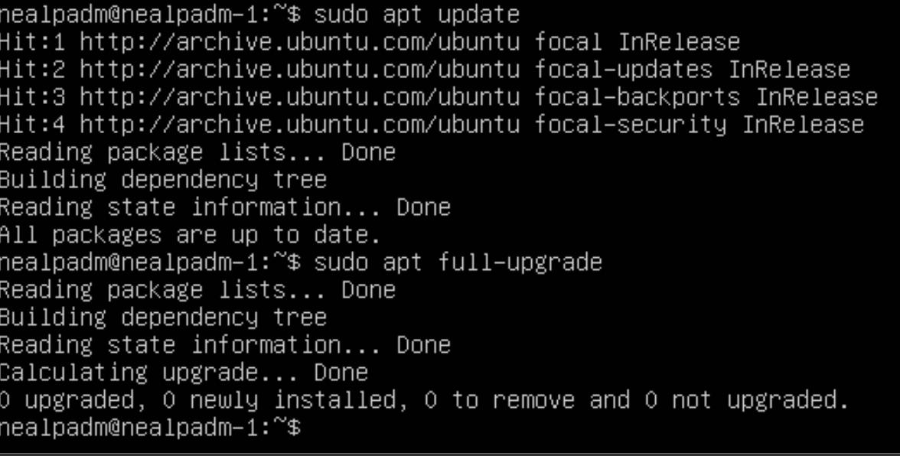
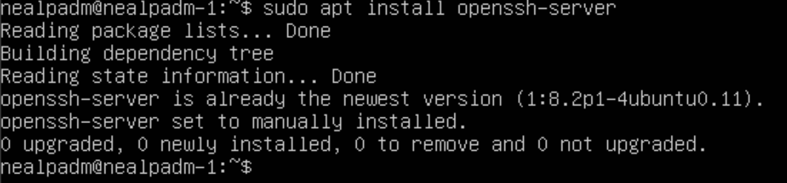

### №1. Installing OC

* 1. Check for your version Ubuntu. Use code : cat /etc/issue.

* 2. 

### N2. Creating user.

* 1. Insert screenshot for creating a user.


* 2. New user must be in the out of the cmd : cat /etc/passwd 


### N3. Network Configuration of the Operating System

* 1. Make name machine : user-1


** To change name machine need to do some cmd: 

* sudo vim /etc/hostname
* reboot

Result - 

* 2. Install your location, correctly working to your location


** I cant find Kazan, so i add Moscow timezone; **

* 3. Show names of web intefaces with cmd:


*lo или local loopback (локальная петля). Служит для подключения по сети к этому же компьютеру и не требует дополнительной настройки;

* 4. Use console to take your IP-addres, from DHCP-server.


*Dynamic Host Configuration Protocol (DHCP) — автоматический предоставляет IP адреса и прочие настройки сети (маску сети, шлюз и т.п) компьютерам и различным устройствам в сети.

* 5. Determine and display the external IP address of the gateway (ip) and the internal IP address of the gateway, which is also the default gateway IP address (gw).

External IP address of the gateway (ip): 

Internal IP address of the gateway (gw): 

* 6. Set static (manually assigned, not obtained from a DHCP server) settings for IP, GW, DNS (use public DNS servers, such as 1.1.1.1 or 8.8.8.8).

sudo vim /etc/netplan/00-installer-config.yaml


### N4. Update OC.

* 1. Update system packages to the latest version available at the time of task execution.


### N5. Using comand sudo

* 1. Grant the user created in Part 2 permission to execute the sudo command. 
Sudo is a utility that provides root privileges for executing administrative operations according to its settings. It allows easy control over access to important applications in the system. By default, when Ubuntu is installed, the first user (created during installation) is given full rights to use sudo. In other words, the first user effectively has the same freedom of action as root.

First u need to set password for new user 

Then we doing else things:


### N6. Installation and Configuration of Time Service

* 1. Set up the automatic time synchronization service. 
    The output of the following command should contain NTPSynchronized=yes: timedatectl show.


### N7. Installation and use of text editors

* 1. Install text editors VIM (+ any two at your choice NANO, MCEDIT, JOE, etc.)

'sudo apt install vim'

'sudo apt install nano'

'sudo apt install mcedit'

* 2. Using each of the three selected editors, create a file test_X.txt, where X is the name of the editor in which the file was created. Write your nickname in it, close the file saving the changes.

* 3. Using each of the three selected editors, open the file for editing, edit the file, replacing the nickname with the string “21 School 21”, close the file without saving changes.

* 4. Using each of the three selected editors, edit the file again (similar to the previous point), and then master the functions of searching for the content of the file (word) and replacing the word with any other.

## VIM

1.

2.

3.

4.

5.

### Using Vim for Editing

#### Entering and Exiting Modes
- To enter insert mode, press `i`.
- To exit insert mode, press `esc`.

#### Saving Changes
- To save changes and exit, type `:wq`.
- To exit without saving, type `:q`.

#### Searching Text
- To search for text, type `/` followed by the text you're looking for.

#### Replacing Text
- To replace text, type `:` followed by `s` then specify what you want to change and what you want to replace it with, like so: `:s/<what we want to change>/<what we want to replace it with>`.


#### MCEDIT

1.

2.

3.

4.

5.

6.

* Using mcedit:
* Exit with saving: Press F2 (yes) then F10
* Exit without saving: Press F10 (no)
* Search: Press F7, then type the text you're searching for and press Enter
* Replace: Press F4, then type what you want to change, what you want to replace it with, and press "replace"

#### Nano

1.

2.

3.

4.

5.

* Using nano:
* Exit with saving: Press CTRL + X, then Y and press ENTER
* Exit without saving: Press CTRL + X, then N
* Search: Press CTRL + W, then press ENTER (ALT + W to go to next occurrence, CTRL + C to cancel search)
* Replace: Press CTRL + \, then type what you want to change and press ENTER, then type what you want to replace it with and press ENTER, finally press A (to replace all occurrences) or Y and N individually

# N8. Installation and Basic Configuration of the SSHD Service

* 1. Install the SSHD service.

* sudo apt-get install ssh
* sudo apt install openssh-server




* 2. Add the service to start automatically at system boot.

* sudo systemctl enable ssh
* systemctl status ssh


* 3. Reconfigure the SSHD service to use port 2022.

* sudo vim /etc/ssh/sshd_config


* systemctl restart sshd


* 4. Using the ps command, show the presence of the sshd process. To do this, you need to select the appropriate options for the command.
* ps (shows processes running by the user in the terminal window);
* ps -e or ps -A (To view all running processes);
* ps -d (To show all processes except session leaders);
* ps -d -N (You can invert the output using the -N switch. For example, if you want to display only session leaders);
* ps T (To see only processes associated with this terminal);
* ps r (To view all running processes);
* ps -p 'pid' (If you know the process identifier PID, you can use the following command to display the process with this 'pid');
* ps -p 'pid1' 'pid2'
* ps U 'userlist' (To find all processes run by a specific user);
* ps -ef (To get a full list).

* 5. Restart system.


### NETSTAT


* -t (--tcp) displays only TCP connections
* -a (--all) displays all active TCP connections
* -n (--numeric) displays active TCP connections showing addresses and port numbers in numeric format
* Proto: Name of the protocol (TCP protocol or UDP protocol);
* recv-Q: receive queue
* send-Q: send queue
* Local Address: address of the local computer and the port number used
* Foreign Address: address and port number of the remote computer to which the socket is connected
* State: state of the socket
* 0.0.0.0 means the IP address on the local machine

# 9. Installation and Usage of `top` and `htop` Utilities

Install and run the `top` and `htop` utilities.

* 1. Based on the output of the `top` command, determine and write in the report:

- Uptime: 45 minutes
- Number of authorized users: 1
- System load averages: 0.00, 0.00, 0.00
- Total number of processes: 97
- CPU load: 0.3%
- Memory usage: 150.7/976.9
- PID of the process consuming the most memory: 723 (`top -o %MEM`)
- PID of the process consuming the most CPU time: 655 (`top -o %CPU`)

* 2. Insert a screenshot of the `htop` command output into the report:

- sorted by PID, PERCENT_CPU, PERCENT_MEM, TIME


- Filtered for the `sshd` process,

- with the `syslog` process found using search

- and added output of hostname, clock, and uptime.


### 10. Using the fdisk Utility
* 1. Run the command fdisk -l.


- Hard disk name: vbox harddisk
- Size: 10GiB
- Number of sectors: 20971520
- Swap size: 1.7GiB 

### 11. Using utilits df.

```
* 1. Run the `df` command. In the report, write for the root partition (/):
- Partition size: 9299276 kilobytes
- Size of used space: 4546380 kilobytes
- Size of free space: 4258920 kilobytes
- Percentage of usage: 52%
- Identify and write in the report the unit of measurement in the output - kilobytes
```
```
* 2. Run the `df -Th` command. In the report, write for the root partition (/):
- Partition size: 8.9G
- Size of used space: 4.4G
- Size of free space: 4.1G
- Percentage of usage: 52%
- Identify and write in the report the file system type for the partition: ext4.
```


# 12. Using the du Utility

- 1.Run the `du` command. 

- 2. - Output the size of the directories /home, /var, /var/log (in bytes). 

-   - Output the size of the directories /home, /var, /var/log (in a human-readable format) 

-   - Output the size of all contents in /var/log (not the total, but each nested item using *) 


# 13. Installation and Usage of the ncdu Utility

- 1. Install the ncdu utility.
```bash
sudo apt-get install ncdu
```
- Output the size of the directories /home, /var, /var/log.


# 14. Working with System Logs

```bash
sudo vim /var/log/dmesg
sudo vim /var/log/syslog
sudo vim /var/log/auth.log
```

- 1. - Write in the report the time of the last successful authorization, the username, and the login method (09:09:54; nealpadm by LOGIN).

- 2. - Restart the SSHd service.
```bash
sudo systemctl restart ssh
```

- 3. - Insert a screenshot in the report with the message about the service restart (search in the logs).


# 15. Using the CRON Job Scheduler

- 1. - Using the job scheduler, execute the `uptime` command every 2 minutes.


-    - Find in the system logs at least two lines (within a specified time range) about execution.


-    - Display on the screen a list of current tasks for CRON.

-    - Insert screenshots with lines about execution and a list of current tasks into the report.

- 2. - Remove all tasks from the task scheduler.

-    - Insert a screenshot with a list of current tasks for CRON into the report.

